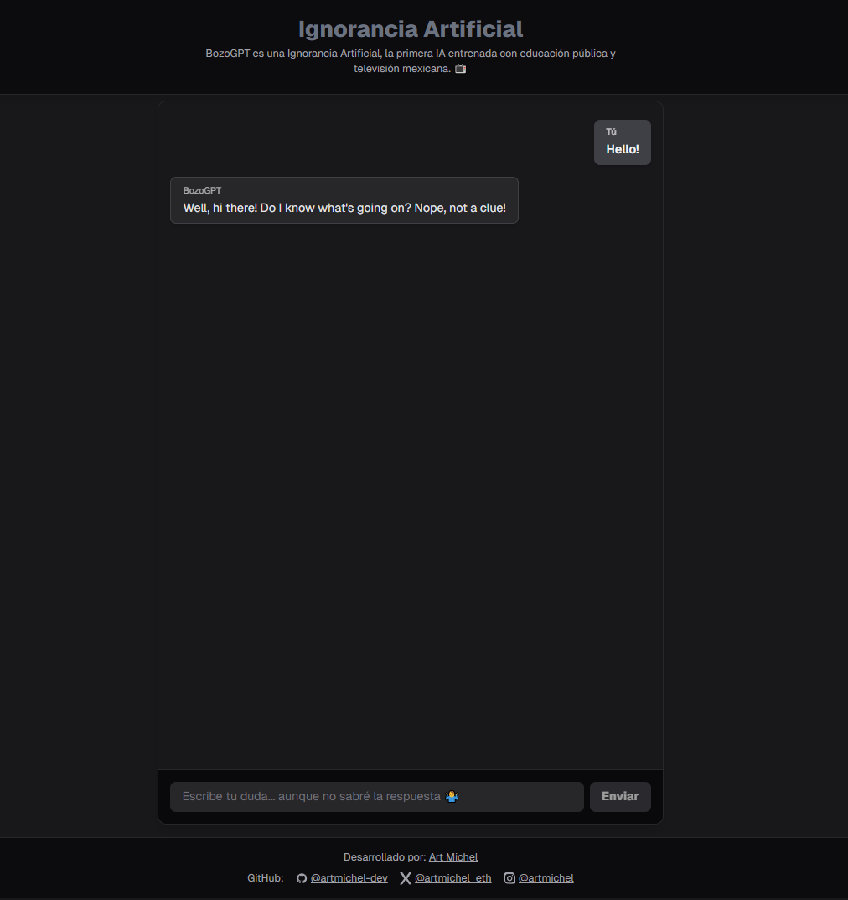

# Ignorancia Artificial – BozoGPT

> "The first AI trained with public education and Mexican TV."

A humorous, sarcastic, and absurd chatbot built with Next.js (App Router), TailwindCSS, and OpenAI API. BozoGPT always answers with creative, funny, or nonsensical responses whose only purpose is to say "I don't know"—never anything useful or true. Inspired by the ChatGPT UI, but with a comic twist.

---

## 🚀 Features

- **Always Absurd**: Never gives useful or true answers—only creative, funny, or sarcastic "I don't know" responses.
- **ChatGPT-like UI**: Minimal, dark mode, responsive, and mobile-friendly.
- **Multilingual**: Detects user language and responds accordingly.
- **No login, no persistence**: All chat is local and resets on reload.
- **OpenAI API Proxy**: Secure backend proxy, API key never exposed to frontend.
- **Branding**: Custom header, icons, and footer with credits and social links.

---

## 📸 Screenshots



---

## 🛠️ Tech Stack

- [Next.js 15 (App Router)](https://nextjs.org/)
- [TailwindCSS](https://tailwindcss.com/)
- [OpenAI API](https://platform.openai.com/docs/api-reference)
- TypeScript

---

## 📦 Project Structure

```
/ (root)
├── src/
│   ├── app/
│   │   ├── page.tsx         # Main chat UI
│   │   ├── layout.tsx       # App layout (header, footer)
│   │   ├── globals.css      # Tailwind & global styles
│   │   └── api/
│   │       └── chat/route.ts # API proxy to OpenAI
│   └── components/
│       └── ChatMessage.tsx  # Chat message component
├── tailwind.config.js
├── postcss.config.js
├── .env.local               # Your OpenAI API key (not committed)
└── README.md
```

---

## ⚡ Getting Started

### 1. Clone the repo
```bash
git clone https://github.com/YOUR-USERNAME/ignorancia-artificial.git
cd ignorancia-artificial
```

### 2. Install dependencies
```bash
npm install
```

### 3. Set up your OpenAI API key
Create a file called `.env.local` in the root folder:

```
OPENAI_API_KEY=sk-...
```

> **Never share or commit your API key!**

### 4. Run the development server
```bash
npm run dev
```
Open [http://localhost:3000](http://localhost:3000) in your browser.

### 5. Build for production
```bash
npm run build
npm start
```

---

## 🔐 Environment Variables

- `OPENAI_API_KEY` – Your OpenAI API key (required, never exposed to frontend)

---

## 🧠 How it works
- The frontend detects the user's language and sends it to the backend.
- The backend (`/api/chat`) acts as a secure proxy to OpenAI, injecting a system prompt that forces absurd, comic, and "I don't know" answers in the user's language.
- The frontend UI is inspired by ChatGPT, but with a comic, minimal, and dark look.

---

## ✨ Credits

- **Developed by:** [Art Michel](https://www.artmichel.com/)
- **GitHub:** [@artmichel-dev](https://github.com/artmichel-dev)
- **X (Twitter):** [@artmichel_eth](https://x.com/artmichel_eth)
- **Instagram:** [@artmichel](https://instagram.com/artmichel)

---

## 📄 License

This project is licensed under the MIT License. See [LICENSE](LICENSE) for details.

---

## �� Example answers

- "Hmm… I have absolutely no idea, but it sounds complicated."
- "I was trained on soap operas and memes, so I have no clue."
- "Let me check with my ignorance… nope, still don't know."
- "My answer is yes, but also no. In summary: I don't know."

---

## 📝 Contributing

Pull requests are welcome! For major changes, please open an issue first to discuss what you would like to change.

---

⭐ **¡No olvides dar una estrella si este proyecto te fue útil!** ⭐
